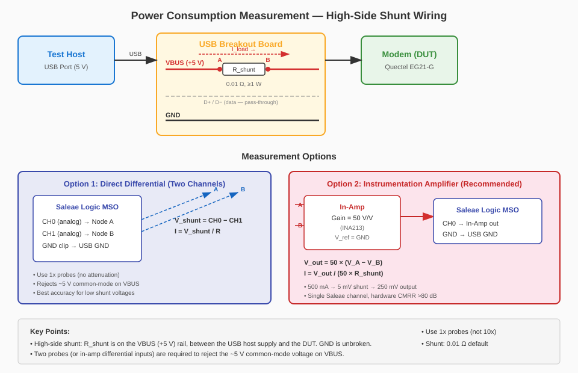

# Power Consumption Testing

## Overview

This test suite measures USB device (modem) power consumption during various
operating states using a **Saleae Logic MSO** mixed-signal oscilloscope.
A shunt resistor on the USB VBUS line converts current draw into a voltage
measured by the MSO's analog input.  The captured waveform covers the full
state transition so registration spikes, PDP activation, and TX ramp-up are
all visible.

## Hardware Setup

### Required Equipment

- Saleae Logic MSO (connected to the test host via USB)
- USB breakout / passthrough board (exposes VBUS and GND lines)
- Current-sense shunt resistor (default: 0.01 Ω, ≥ 1 W)
- R&S CMW500 Base Station Simulator (existing test-bench equipment)
- Quectel EG21-G modem under test
- *(Optional)* Instrumentation amplifier board — gain 20 V/V, CMRR > 80 dB
  (e.g. AD8421, INA128, or INA219 breakout with analog output)

### Wiring — High-Side Shunt

The shunt resistor is placed on the **high side** (VBUS / +5 V rail), keeping
the GND return path unbroken.  A low-side shunt would shift the DUT ground
reference, risking USB signal integrity issues and ground loops.



```
           HIGH-SIDE SHUNT — USB VBUS rail
           ================================

Test Host                USB Breakout Board                     Modem (DUT)
─────────┐     ┌──────────────────────────────────────┐     ┌──────────
         │     │  VBUS (+5 V)                         │     │
     USB ├─────┤──── (A) ──┤ R_shunt ├── (B) ─────────┤─────┤ VBUS
  socket │     │            0.01 Ω                     │     │
         │     │  D+  ─────────────────────────────────┤     │ D+
         │     │  D−  ─────────────────────────────────┤     │ D−
         │     │  GND ─────────────────────────────────┤     │ GND
─────────┘     └──────────┬────────────────────────────┘     └──────────
                          │
                          │  Current direction: A ──────► B (into DUT)
                          │
              ┌───────────┴────────────────────────────────┐
              │  MEASUREMENT (choose one option)           │
              │                                            │
              │  Option 1 — Direct differential            │
              │    Saleae CH0 ─── Node A                   │
              │    Saleae CH1 ─── Node B                   │
              │    Saleae GND ─── USB GND                  │
              │    V_shunt = CH0 − CH1  (computed in SW)   │
              │                                            │
              │  Option 2 — Instrumentation amplifier       │
              │    In-Amp IN+ ─── Node A                   │
              │    In-Amp IN− ─── Node B                   │
              │    In-Amp REF ─── USB GND                  │
              │    In-Amp OUT ─── Saleae CH0               │
              │    Saleae GND ─── USB GND                  │
              │    Gain = 20 V/V                           │
              └────────────────────────────────────────────┘
```

#### Why high-side?

| Topology   | Shunt location      | Advantage            | Disadvantage                             |
|------------|---------------------|----------------------|------------------------------------------|
| High-side  | VBUS (+5 V) rail    | GND undisturbed      | Both shunt nodes sit at ~5 V (common-mode) |
| Low-side   | GND return path     | Easy single-ended    | Shifts DUT GND, USB signalling problems  |

High-side is the correct choice here.  The common-mode issue is handled by
either the two-channel differential technique or the instrumentation amplifier.

#### Step-by-step wiring

1. Insert the USB breakout board between the test host and the modem.
2. Place the shunt resistor **in series on the VBUS (+5 V) line** (high side).
   Label the host-side node **A** and the DUT-side node **B**.
3. Connect probes / in-amp as described in the measurement options below.
4. Connect the Saleae GND clip to the USB GND plane.

### Measurement Options

#### Option 1: Direct differential (two Saleae channels)

Connect **two** Saleae analog channels — one to each node of the shunt:

| Connection   | Target    |
|--------------|-----------|
| Saleae CH0   | Node A    |
| Saleae CH1   | Node B    |
| Saleae GND   | USB GND   |

The shunt voltage is computed in software:

```
V_shunt = CH0 − CH1
I       = V_shunt / R_shunt
```

**Why two probes?**  Both nodes A and B sit at approximately +5 V relative to
GND.  A single probe across the shunt would measure a tiny differential
(millivolts) riding on a large common-mode voltage (~5 V).  Using two channels
and subtracting in software rejects this common-mode voltage, giving a clean
shunt voltage measurement.

#### Option 2: Instrumentation amplifier (single Saleae channel)

For oscilloscopes with limited voltage resolution, or when the shunt voltage
is too small for reliable direct digitisation, insert an instrumentation
amplifier between the shunt and the Saleae input:

| Connection       | Target            |
|------------------|-------------------|
| In-Amp IN+       | Node A            |
| In-Amp IN−       | Node B            |
| In-Amp V_ref     | USB GND           |
| In-Amp V_out     | Saleae CH0        |
| Saleae GND       | USB GND           |

Suggested ICs: INA219 (with analog output breakout), AD8421, INA128, or any
rail-to-rail in-amp with CMRR > 80 dB at the common-mode voltage (~5 V).

With a gain of **20 V/V**:

```
V_out = 20 × (V_A − V_B) = 20 × I × R_shunt
I     = V_out / (20 × R_shunt)
```

| I_load   | V_shunt (0.01 Ω) | V_out (20× gain) |
|----------|-------------------|-------------------|
| 100 mA   | 1.0 mV            | 20 mV             |
| 500 mA   | 5.0 mV            | 100 mV            |
| 1.0 A    | 10.0 mV           | 200 mV            |

The in-amp provides hardware common-mode rejection (typically > 80 dB) and
amplifies the shunt voltage into a range the ADC can resolve cleanly.  Only
one Saleae analog channel is required.

### Probe Selection — 1x vs 10x

Use **1x probes** (or direct connections) for shunt voltage measurements.

| Probe   | Attenuation | Shunt V @ 500 mA | Signal at ADC | Verdict     |
|---------|-------------|-------------------|---------------|-------------|
| 1x      | none        | 5.0 mV            | 5.0 mV        | Correct     |
| 10x     | ÷ 10        | 5.0 mV            | 0.5 mV        | Too small   |

A 10x probe divides the already-tiny shunt voltage by 10, pushing it below
the ADC's effective resolution.  10x probes are designed for high-voltage
signals where the oscilloscope input would otherwise be overloaded — that is
not the case here.

The Saleae Logic MSO analog inputs are direct-connect (effectively 1x), so no
external probe attenuation is needed when wiring directly.

### Probe Configuration

| Parameter        | Default        |
|------------------|----------------|
| Analog channel   | 0 (and 1 for differential) |
| Sample rate      | 10 MSa/s       |
| Shunt resistance | 0.01 Ω         |
| Probe attenuation| 1x (direct)    |
| In-amp gain      | 20 V/V (if used)|

## Software Prerequisites

### Install the optional power dependency group

```bash
uv sync --group power
```

This installs:

- `saleae-mso-api` — Python API for Saleae Logic MSO
- `numpy` — used for waveform analysis (mean, min, max, std)

### Linux udev rules

On Linux, configure udev so the MSO device is accessible without root:

```bash
uv run python -m saleae.mso_api.utils.install_udev
```

### Saleae Logic software

Ensure the Saleae Logic 2 desktop application (≥ 2.4.20) is installed and
recognises the MSO device before running automated tests.

## Test Conditions

| # | Condition              | Modem State                                          |
|---|------------------------|------------------------------------------------------|
| 1 | Disconnected           | Radio off (`AT+CFUN=0`)                              |
| 2 | Connected idle         | Registered on LTE cell, no data transfer             |
| 3 | Transmit 1 KB          | Registered, data connection active, 1 KB ICMP ping   |
| 4 | Transmit 4 KB          | Registered, data connection active, 4 KB ICMP ping   |
| 5 | Transmit continuous    | Registered, data connection active, sustained ping    |

## Running the Tests

### Basic usage

```bash
uv run pytest tests/integration/test_power_consumption.py -v
```

When `saleae-mso-api` is **not** installed the module is silently skipped
at collection time — no SKIPPED noise in normal test output.

### CLI options

| Option               | Default          | Description                                      |
|----------------------|------------------|--------------------------------------------------|
| `--logic-mso-serial` | (auto)           | Saleae Logic MSO serial number                   |
| `--shunt-resistance` | `0.01`           | Shunt resistance in Ohms                         |
| `--capture-duration` | `5.0`            | Analog capture duration per condition (seconds)  |
| `--power-mode`       | `differential`   | `differential` (2-ch) or `inamp` (1-ch with amp) |
| `--inamp-gain`       | `20.0`           | Instrumentation amplifier gain in V/V            |
| `--skip-power`       | off              | Skip all power consumption tests                 |

### Examples

```bash
# Custom shunt and longer capture
uv run pytest tests/integration/test_power_consumption.py -v \
    --shunt-resistance 0.05 --capture-duration 20

# Use instrumentation amplifier mode with custom gain
uv run pytest tests/integration/test_power_consumption.py -v \
    --power-mode inamp --inamp-gain 20

# Skip power tests when running the full suite
uv run pytest tests/ -v --skip-power
```

## Capture Methodology

For each test condition the sequence is:

1. **Start MSO capture** — a timed analog capture begins in a background
   thread.  The capture is running *before* the modem condition is
   established so the full transition waveform is recorded.
2. **Establish modem condition** — turn radio off, register on the LTE
   cell, activate a data connection, or start transmitting data.
3. **Hold condition** — the modem remains in the target state for the
   remainder of the capture window.
4. **Capture completes** — the MSO timed capture finishes naturally (never
   terminated early).
5. **Compute current** — voltage samples are converted to current via
   `I = V / R_shunt`.  Average, minimum, maximum, and standard deviation
   are reported.

### Data transmission

- **1 KB / 4 KB**: `ping -I <modem_iface> -s 1024 -c N <target_ip>` where
  N = 1 for 1 KB and N = 4 for 4 KB.  The subprocess timeout is set to
  `capture_duration + 2 s` so it finishes naturally.
- **Continuous**: background `ping` at ~10 packets/second (1024-byte
  payload, 100 ms interval) for the full capture duration.  The subprocess
  is given `capture_duration + 2 s` to complete — it is **not** killed
  early.

The modem's USB ECM network interface (`usb0`, `wwan0`, etc.) is
auto-detected.  Traffic targets the DAU gateway IP.

## Interpreting Results

Each test logs a summary line:

```
TRANSMIT CONTINUOUS: avg=142.3 mA, min=38.1 mA, max=487.6 mA
```

| Metric            | Meaning                                            |
|-------------------|----------------------------------------------------|
| `avg_current_ma`  | Mean current over the full capture window           |
| `min_current_ma`  | Minimum instantaneous current (baseline / idle)     |
| `max_current_ma`  | Peak current (TX burst or registration spike)       |
| `std_current_ma`  | Standard deviation — indicates variability          |
| `avg_voltage_mv`  | Mean voltage across the shunt (for sanity checking) |

### Comparing runs

Run the tests multiple times and compare the average current for each
condition to identify regressions.  The MSO capture files are saved to
`tmp_path` (pytest temporary directory) and can be reloaded for offline
analysis.

## Configuration Reference

| Constant                          | Default          | Override CLI option    |
|-----------------------------------|------------------|-----------------------|
| `POWER_CAPTURE_DURATION_SEC`      | 5.0 s            | `--capture-duration`  |
| `POWER_DEFAULT_SHUNT_OHMS`        | 0.01 Ω           | `--shunt-resistance`  |
| `POWER_DEFAULT_MODE`              | `differential`   | `--power-mode`        |
| `POWER_DEFAULT_INAMP_GAIN`        | 20.0 V/V         | `--inamp-gain`        |
| `POWER_SAMPLE_RATE_HZ`            | 10,000,000       | (code only)           |
| `POWER_ANALOG_CHANNEL`            | 0                | (code only)           |
| `POWER_DIFFERENTIAL_CHANNEL_A`    | 0                | (code only)           |
| `POWER_DIFFERENTIAL_CHANNEL_B`    | 1                | (code only)           |
| `POWER_CONDITION_SETTLE_SEC`      | 3.0 s            | (code only)           |
| `POWER_CONTINUOUS_TX_DURATION_SEC` | 10.0 s          | (code only)           |
| `POWER_SUBPROCESS_GRACE_SEC`      | 2.0 s            | (code only)           |
| `TEST_TIMEOUT_POWER`              | 300 s            | (code only)           |

All constants are defined in `tests/constants.py`.
